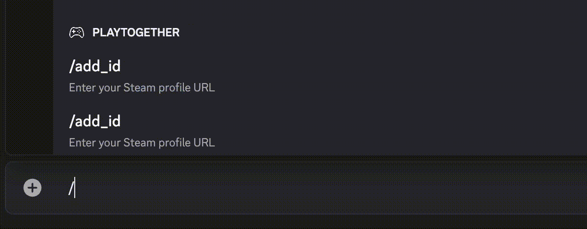
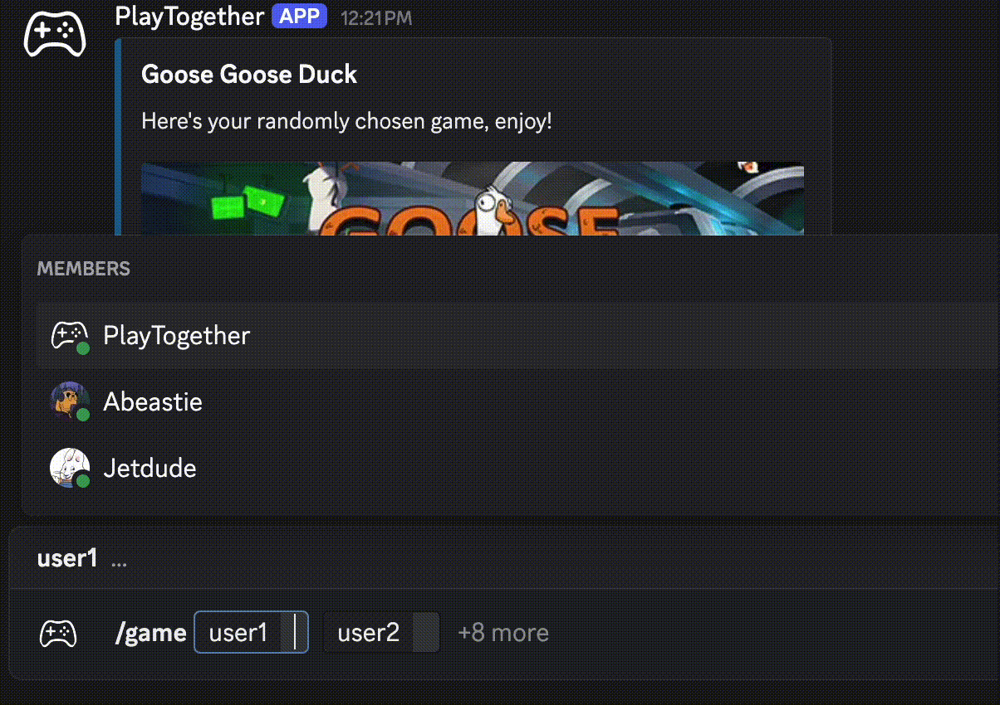

# PlayTogether-Bot
Ever been stuck deciding what to play with your friends on Discord? PlayTogether solves that problem by randomly selecting a multiplayer game everyone owns!

## Requirements
* Python >= 3.13
* discord.py >= 2.5.2
* requests >= 2.32.4

## Installation 
If you'd like to host the PlayTogether bot on your computer, you must do the following to install it on your device:

1. Clone the repo:
```
git clone https://github.com/enriqueorozc/PlayTogether-DiscordBot.git
cd PlayTogether-DiscordBot
```

2. (Optional) Create a virtual environment:
```
python3 -m venv venv
source venv/bin/activate
```

3. Install the dependencies:
```
pip install -r requirements.txt
```

4. Follow this guide to create and configure your bot:
Creating a Bot Account: https://discordpy.readthedocs.io/en/stable/discord.html

## Add PlayTogether
If you'd like to add the PlayTogether bot to your server, [click here.](https://discord.com/oauth2/authorize?client_id=1288990665111375985&permissions=67584&integration_type=0&scope=bot)

## How to Use PlayTogether
As of the current version, PlayTogether supports three commands:
* /add_id - Links your Steam profile
* /refresh - Updates your owned games
* /game - Returns a randomly selected shared multiplayer game

PlayTogether works by saving the list of games owned by each user's public Steam profile into an SQLite database.

To get started a user must run the **/add_id** command and provide their public Steam profile URL. Once verified, their owned games will be stored into the database. If the user purchases new games later, they can use the **/refresh** command to update their library.

<p align="center">
  
</p>

To get a random multiplayer game, use the **/game** command. It requires a minimum of two, and supports up to ten, non-bot Discord users from the same server. All the selected users must have previously added their Steam profile by using the **/add_id** command.

<p align="center">
  
</p>

## FAQ

1. Does my Steam profile need to be public?\
Yes, your Steam profile must be set to public in order for the PlayTogether bot to access your game library.

2. Why does the **/game** command take so long?\
The command may take a bit longer the first time it’s used with new users. This is because while searching for commonly owned multiplayer games it's issuing multiple requests to the Steam Web API to get information about each game. To reduce this time for each subsequent runs, the bot stores each game after it's request.

3. Are my hidden games included?\
No, hidden games are not included because that information isn’t publicly available. The PlayTogether bot only uses public information from your Steam account.

## Support
If there are any issues or if you have any suggestions for the PlayTogether bot, please let me know. You can reach me at:\
enrique-orozco@outlook.com
